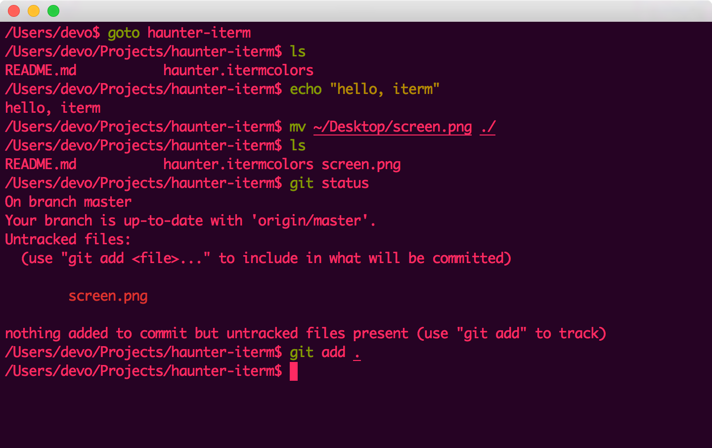

# Haunter Iterm

A spooky color theme for iterm2.

## Install

+ Launch iTerm 2
+ Type `CMD+,` (`⌘+,`)
+ Navigate to **Profile -> Colors** tab
+ Click on **Load Presets**
+ Click on **Import**
+ Import the `haunter.itermcolors` file
